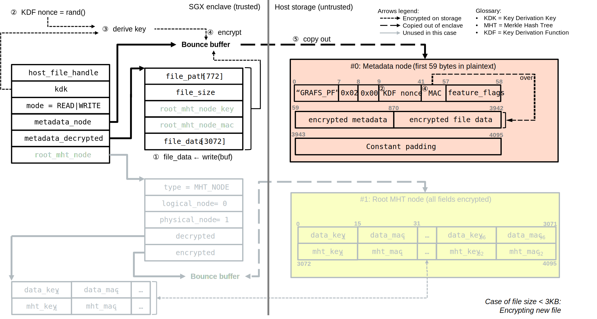

Encrypted Files in Gramine
==========================

.. note ::
   This is a highly technical document intended for crypto practitioners.

   This is a living document. The last major update happened in **April 2024**
   and closely corresponds to Gramine v1.6.

   A short introduction to the "protected files" feature as implemented in Intel
   SGX SDK was also published in `this old blog post
   <https://web.archive.org/web/20230401201058/https://www.tatetian.io/2017/01/15/understanding-sgx-protected-file-system/>`__.

Gramine provides a feature of :ref:`encrypted-files`, which encrypts files and
transparently decrypts them when the application reads or writes them.
Integrity- or confidentiality-sensitive files (or whole directories) accessed by
the application must be put under the "encrypted" FS mount in the Gramine
manifest. New files created in the "encrypted" FS mount are automatically
treated as encrypted. The format used for encrypted and integrity-protected
files is borrowed from the "protected files" feature of Intel SGX SDK (see the
corresponding section in `Intel SGX Developer Reference manual
<https://download.01.org/intel-sgx/sgx-linux/2.23/docs/Intel_SGX_Developer_Reference_Linux_2.23_Open_Source.pdf>`__).

Each encrypted file is encrypted separately, i.e. Gramine employs file-level
encryption and not block-level encryption. Each "encrypted" FS mount can have a
separate encryption key (more precisely, this is the key derivation key or KDK).
More information on the usage of encrypted files can be found in the
:ref:`encrypted-files` manifest syntax.

The feature was previously called "protected files" or "protected FS", same as
in Intel SGX SDK. These legacy names may still be found in Gramine codebase.

Encrypted files are primarily used with TEEs (Trusted Execution Environments)
like Intel SGX, i.e. with :program:`gramine-sgx`. However, for debug purposes,
encrypted files are also functional in :program:`gramine-direct`.

Security guarantees of encrypted files
--------------------------------------

The current implementation of encrypted files in Gramine provides the following
security guarantees:

- **Confidentiality of user data**: all user data is encrypted and then written
  to untrusted host storage; this prevents user data leakage.
- **Integrity of user data**: all user data is read from disk and decrypted,
  with the Message Authentication Code (MAC) verified to detect any data
  tampering.
- **Matching of file name**: when opening an existing file, the metadata of the
  to-be-opened file is checked to ensure that the name of the file when created
  is the same as the name given to the open operation.

The current implementation does *not* protect against the following attacks:

- **Rollback/replay attacks after file close**. The user cannot detect whether
  he has opened an old (but authenticated) version of a file. In other words,
  Gramine does not guarantee the freshness of user data in the file after this
  file was closed. Note that while the file is opened, the rollback/replay
  attack is prevented (by always keeping the root hash of a Merkle tree over the
  file in trusted enclave memory and checking the consistency during accesses,
  see more details below).
- **Side-channel attacks**. Some file metadata, such as file name, file size,
  access time, access patterns (e.g., which blocks are read/written), etc. is
  not confidentiality-protected. This could be used by attackers to gain
  sensitive information. See also
  https://gramine.readthedocs.io/en/stable/devel/features.html#file-systems for
  additional discussions on file metadata.

.. note ::
   There is an effort to improve rollback/replay attack protection in Gramine.
   See the discussion in https://github.com/gramineproject/gramine/issues/1835.

Encrypted Files subsystem in Gramine codebase
---------------------------------------------

Encrypted Files logic is implemented as a separate subsystem, only loosely
coupled with the rest of Gramine. Integration with the rest of Gramine code is
based on:

- A set of public functions like ``pf_open()``, ``pf_read()``, etc.
- A set of callbacks like ``cb_read_f()``, ``cb_write_f()``, etc.

There is a glue code that serves as a bridge between the Gramine-agnostic
Encrypted Files subsystem and the rest of Gramine. This glue code calls public
functions for high-level operations on encrypted files and registers callbacks
for low-level interactions with the host. E.g., the glue code calls
``pf_read()`` whenever the user application wants to read from the encrypted
file, then the encrypted-files logic performs crypto operations on
encrypted-file's chunks and periodically calls ``cb_read_f()`` to consume the
chunks from the host's storage.

From the Gramine codebase perspective, the split is as follows:

- Generic Encrypted Files code -- :file:`common/src/protected_files/`
- Glue code -- :file:`libos/src/fs/libos_fs_encrypted.c`
- Gramine FS code -- :file:`libos/src/fs/chroot/encrypted.c`

There are several reasons for this decoupling:

- Historical reason -- to ease the porting effort from Intel SGX SDK.
- Reusability -- the encrypted-files code can be used as-is in stand-alone tools
  like :program:`gramine-sgx-pf-crypt`.
- Crypto reviews -- the encrypted-files code is the only place that directly
  uses crypto algorithms, which facilitates crypto/security review efforts.

The application code is *not* aware of encrypted files. Applications treat
encrypted files just like regular files, e.g. apps open file descriptors (FDs),
duplicate them, perform I/O operations on files and then close the FDs. Gramine
intercepts such system calls, creates handles for FDs, consults the manifest
file to learn that these handles are encrypted-files' handles, attaches inodes
to them, and transforms regular I/O operations into encrypted-I/O operations.
Note that before working with a particular encrypted file, the encryption key of
its corresponding FS mount must be already provisioned.

If Gramine detects tampering or integrity inconsistencies on an encrypted file,
Grmaine marks the file as corrupted and refuses any operations on this file. In
particular, the application's operations on the file will return ``-EACCES``.

The diagram above shows the relations between the application, the Gramine FS
code, the Gramine glue code and the generic encrypted-files code. Here the
``libos_encrypted_file`` data structure is hosted in the glue code, and the
``pf_context`` data structure is hosted in the generic encrypted-files code. The
KDK is installed through Gramine interfaces into the ``libos_encrypted_key``
field in the glue code which copies it into the ``kdk`` field in encrypted-files
code. Also, the glue code opens a host file via Gramine's PAL interfaces and
saves the reference to it into ``pal_handle``, which is copied into
``host_file_handle`` in encrypted-files code. With these two fields, plus the
set of registered callbacks, the encrypted-files code has enough information to
encrypt and decrypt files stored on the host's disk.

Crypto used for encrypted files
-------------------------------

- The current implementation of encrypted files uses AES-GCM with 128-bit key
  size for encryption and MAC generation. Thus, all encryption keys are 16B in
  size and all MACs are 16B in size.

- Sub-keys are derived from the user-supplied KDK using the `NIST SP800-108
  <https://csrc.nist.gov/pubs/sp/800/108/r1/upd1/final>`__ construction, with
  the required PRF (Pseudorandom Function) instantiated by AES-128-CMAC.

- Initialization vectors (IVs) are always all-zeros. This is allowed because
  each node-encryption key is generated randomly and is never re-used.

- Additional authenticated data (AAD) is not used.

- The crypto library used is mbedTLS, frequently updated by Gramine maintainers
  to be of the latest released version.

Representation on host storage and in SGX enclave memory
--------------------------------------------------------

Encrypted files use a special format developed specifically for Intel SGX
usages. In the following, we distinguish between the representation of encrypted
files on host storage (untrusted) and the representation inside the SGX enclave
(trusted).

An encrypted file is stored on the untrusted host storage in a file with the
same pathname, but augmented with additional metadata and split into 4KB chunks
(pages). Each chunk is also referred to as a "node".

An encrypted file is represented inside the SGX enclave as a set of interlinked
data structures and buffers. There is a main data struct ``pf_context`` for each
encrypted file. It contains an opaque reference to the host-file handle
``host_file_handle``, the initial encryption key ``kdk`` (Key Derivation Key),
the mode in which file is opened ``mode``, and references to three other
important structs:

- ``metadata_node`` points to a bounce buffer that syncs the metadata node
  between the SGX enclave and the host storage,
- ``metadata_decrypted`` points to a data struct that contains the decrypted
  part of the metadata node's encrypted header,
- ``root_mht_node`` points to a data struct that represents the root MHT (Merkle
  Hash Tree) node.

Note that bounce buffers are used to prevent TOCTOU (Time of Check to Time of
Use) attacks and to prevent potential leakage of partially encrypted/decrypted
file contents.

Encrypted files on host storage are represented as a string of 4KB chunks. Each
encrypted file starts with a *metadata node*, that has the following three
parts:

1. The plaintext header, occupying bytes 0-57. The header contains a magic
   string, a major version of the encrypted-files protocol, a minor version, a
   salt for KDF (Key Derivation Function, explained later) and a MAC
   (cryptographic hash over the encrypted header).
2. The encrypted header, occupying bytes 58-3941. This header has two parts: the
   encrypted metadata fields and the first 3KB of actual file contents. The
   metadata fields contain a file path (to prevent rename attacks), the file
   size (to hide the exact file size from attackers) and the encryption key and
   MAC of the root MHT node (explained later).
3. The constant padding, occupying bytes 3942-4095. This padding is added purely
   to align the metadata node on the 4KB boundary and contains zeros.

Note that if the original file is less than 3KB in size, then this file's
representation on the host constitutes only a single metadata node (in
particular, there is *no* root MHT node in this case). We will see below the
exact read/write flows for this special case.

After the metadata node, the two node types interleave: the *MHT nodes* and the
*Data nodes*. The data nodes simply contain 4KB of ciphertext corresponding to
the 4KB of plaintext file contents. The MHT nodes serve as building blocks for a
variant of a Merkle Hash Tree.

Each MHT node in the Merkle Hash Tree is comprised of 128 encryption key + MAC
pairs for attached Data and MHT nodes. In particular, one MHT node has 96 pairs
for the Data nodes attached to it, and 32 pairs for the child MHT nodes. Since
each key is 16B in size and each MAC is 16B in size, 128 pairs is the maximum
that can be stored in a 4KB node.

Inside the SGX enclave, each MHT node is represented as a data struct with the
``type`` being ``MHT_NODE`` and two linked buffers: the bounce buffer that
contains the encrypted 4KB copied from the host disk and yet another data
struct that contains the decrypted MHT node's contents (the array with 128 key +
MAC pairs). Additionally, each MHT node has a ``logical_node`` number and a
``physical_node`` number. The former is the serial number in a logical
representation of the MHT nodes in the Merkle tree, whereas the latter is the
number of the page (chunk) in the on-storage representation. The difference
between logical and physical numbers is clear on the below diagram.

Note that there is a special MHT node -- the root MHT node. It has the same
representation inside the SGX enclave and on host storage as all other MHT
nodes, but it is directly linked from the main data struct ``pf_handle`` via the
``root_mht_node`` field. Also, the root MHT node's encryption key and MAC are
stored directly in the encrypted header of the metadata node. The root MHT node
starts to be used when the plaintext file size exceeds 3KB.

Note that the root MHT node is kept in trusted enclave memory for the lifetime
of the file handle (i.e. as long as the file is opened). This is in contrast to
other MHT nodes which can be evicted from enclave memory; see the notes on LRU
cache in :ref:`additional-details`. The fact that the root MHT node is
non-evictable ensures protection against rollback/replay attacks.

The diagram above shows the in-enclave-memory structure of the nodes that
constitute a single encrypted file, as well as the on-disk data layout of the
same file. This diagram visualizes the difference between logical and physical
node numbers: the former are used to calculate the offsets in plaintext file
whereas the latter are used to calculate the offsets in encrypted file. Knowing
the offset in the plaintext file, it is easy to calculate the logical node
number; knowing the logical node number, it is easy to calculate the physical
node number; finally, knowing the physical node number, it is trivial to
calculate the offset in a file on the host storage.

Here is a C code snippet of how the calculation is done::

    #define PF_NODE_SIZE               4096
    #define MD_USER_DATA_SIZE          3072
    #define ATTACHED_DATA_NODES_COUNT  96
    #define CHILD_MHT_NODES_COUNT      32

    logical_data_node_number = (plaintext_file_offset - MD_USER_DATA_SIZE) / PF_NODE_SIZE;
    logical_mht_node_number  = logical_data_node_number / ATTACHED_DATA_NODES_COUNT;

    physical_data_node_number = logical_data_node_number
                                + 1 // metadata node
                                + 1 // MHT root node
                                + logical_mht_node_number; // MHT nodes in-between

    physical_mht_node_number  = _physical_data_node_number
                                - logical_data_node_number % ATTACHED_DATA_NODES_COUNT
                                - 1;

    encrypted_file_offset = physical_data_node_number * PF_NODE_SIZE

Encrypted I/O: case of file size less than 3KB
----------------------------------------------

Below are the flows for a special case of encrypted-file I/O, for files with
sizes less than 3KB. Such files are represented on the host using a single
metadata node.

Assume an encrypted file created by the application. The file is first
represented solely in SGX enclave memory and is saved to untrusted host storage
on a write (or more typically, on an explicit flush operation).

Upon file creation, Gramine sets up three data structures representing the file:
the main ``pf_context`` struct that has the reference to the correspoding host
file and the user-supplied KDK, the ``metadata_node`` bounce buffer that will be
copied out to host storage and the ``metadata_decrypted`` struct that has the
file name, the file size and a 3KB buffer to hold file contents.

In step 1, the application writes less than 3KB of data into the file. This data
is copied from the user buffer into the ``file_data`` buffer. This ``write()``
system call triggers the flow of encrypting the file and saving it to disk.

To encrypt the file, Gramine needs to generate a new key. To this end, a KDF
salt is randomly generated in step 2. Then in step 3, a `NIST SP800-108
<https://csrc.nist.gov/pubs/sp/800/108/r1/upd1/final>`__ KDF (Key Derivation
Function) is used to derive an AES-128 sub-key, with input materials being the
KDK, the hard-coded label ``SGX-PROTECTED-FS-METADATA-KEY`` and the salt as
nonce.

Now that a new key was derived, the file can be encrypted. Step 4 shows that the
AES-GCM encryption happens in the ``metadata_node`` bounce buffer, on the
plaintext data struct ``metadata_decrypted`` and with the newly derived key.

Finally in step 5, the resulting ciphertext is copied out from the bounce buffer
to the host storage. An additional plaintext header in bytes 0-57 is prepended
to the ciphertext, and the padding in bytes 3942-4095 aligns the resulting
metadata node to 4KB. Note that the plaintext header contains the KDF salt
generated in step 2 and the MAC generated as a by-product of AES-GCM encryption
in step 4. The salt and the MAC can be stored in plaintext, and they will be
used later to decrypt the metadata node's ciphertext.

Now assume that an encrypted file previously created by the application must be
read by another application. The application opens a file with the ``open()``
system call which instructs Gramine to set up the same three data structures
representing the file as for the write flow. Note that the KDK must have been
already supplied by the user application, and must be the same as was used for
file write.

Then the app wants to read the file data. This triggers the read flow depicted
on the diagram above. The encrypted file is represented on the untrusted storage
as a single 4KB metadata node, which consists of a plaintext header, an
encrypted part, and an unused padding.

In step 1, the metadata node is copied into the enclave's bounce buffer
``metadata_node``. The actual file contents are stored in ``file_data`` which is
located in the encrypted-header part of the metadata node. Thus, Gramine must
decrypt the encrypted header. To obtain the same key as was used for encryption,
a KDF salt is read from the plaintext header in ``metadata_node`` (step 2). Then
in step 3, AES-CMAC is used for key derivation, with input materials being the
KDK and the salt.

Now that the key is derived, the metadata's encrypted header can be decrypted.
Step 4 shows that the AES-GCM decryption happens on the ``metadata_node`` bounce
buffer, with plaintext output moved into the data struct ``metadata_decrypted``.
As part of the decryption operation, the resulting MAC is compared against the
one read from the plaintext header in ``metadata_node``. If comparison fails,
then Gramine stops operations on this encrypted file and considers it corrupted;
an ``-EACCES`` error is returned to the application.

Finally in step 5, the resulting ``file_data`` plaintext is copied to the
application buffer. The ``read()`` operation is finished.

Note that in the special case of files of size less than 3KB, only the metadata
node is used. No MHT nodes and no data nodes are stored on the host. Also, the
``root_mht_node_key`` and ``root_mht_node_mac`` fields are unused in the
metadata node's encrypted header.

Encrypted I/O: general case
---------------------------

Below are the flows for the general case of encrypted-file I/O, i.e. for files
with sizes greater than 3KB.

Assume an encrypted file created by the application. The application writes more
than 3KB of data into this file.

The write flow contains similar steps to the flow described for files of less
than 3KB size above. We will only briefly outline the logic.

The first 3KB of user-supplied data are copied into the ``file_data`` buffer of
the metadata node (step 1). The next 4KB of user-supplied data must be copied in
a data node. When Gramine notices that a new data node is required, it creates
the data node representation in enclave memory, consisting of the main data-node
struct, the ``decrypted`` 4KB buffer and the ``encrypted`` 4KB bounce buffer
(step 2). The file data are copied into the ``decrypted`` buffer.

Since we have at least one data node, we must have a corresponding MHT node to
which this data node will be attached. Thus Gramine activates the root MHT node
representation in enclave memory, consisting of the main MHT-node struct, the
``decrypted`` 4KB array and the ``encrypted`` 4KB bounce buffer. Note that there
is no need to link the data node and the root MHT node explicitly -- a
correspondence between these nodes can be established via calculations on
logical and physical numbers of the nodes (see the C code snippet above).

Now to encrypt the 4KB of file contents stored in the data node's ``decrypted``
buffer, Gramine needs to generate a new key. The key is simply a 128-bit random
number (step 3). This key is stored in a corresponding slot of the root MHT
node. Since the MHT node's contents will also be encrypted, the key will not be
leaked.

Now that a new key for the data node was generated, the data node can be
encrypted. Step 4 shows that the AES-GCM encryption happens in the ``encrypted``
bounce buffer of the data node, on the plaintext data-node buffer ``decrypted``
and with the newly generated key. As part of this encryption operation, the MAC
is generated and is stored in the corresponding slot of the root MHT node (thus
shaping a key + MAC pair for data node 1). Since the MHT node's contents will
be encrypted, the MAC will not be leaked.

At this point, the 4KB of the file data are stored as ciphertext in the bounce
buffer of the data node and are ready to be flushed to storage. However, the
root MHT node must also be encrypted and flushed.

The root MHT node is already updated with the data node's key and MAC (more
specifically, only slot 1 of the MHT node's ``decrypted`` array was updated, the
rest slots contain all-zeros). So it's only a matter of encrypting the root MHT
node. For this, a new random key is generated (step 5). This key is stored in
the ``root_mht_node_key`` field of the metadata node's header. Since the header
will be encrypted, the key will not be leaked.

Now that a key for the root MHT node was generated, the root MHT node can be
encrypted. Step 6 shows that the AES-GCM encryption happens in the ``encrypted``
bounce buffer of the root MHT node, on the plaintext root-MHT-node ``decrypted``
and with the newly generated key. As part of this encryption operation, the MAC
is generated and is stored in the ``root_mht_node_mac`` field of the metadata
node's header. Since the header will be encrypted, the MAC will not be leaked.

At this point, both the data node and the root MHT node are ready to be flushed
to storage. Now steps 7-9 are performed, which correspond to steps 2-4 in the
write flow of the <3KB file.

Finally, all three nodes are encrypted and are ready to be flushed: the metadata
node (contains the salt to decrypt itself and the key + MAC to decrypt the root
MHT node), the root MHT node (contains the key + MAC to decrypt the data node)
and the data node (contains the file contents). Step 10 can be performed, that
copies out all three bounce buffers to the host's hard disk.

The above description works for a case of a file with at most 7KB of data (3KB
stored in metadata header and 4KB stored in the data node). The diagram below
shows a generalized flow for files of arbitrary sizes; the step numbers in the
diagram correspond to the steps in the above description.

Now assume that an encrypted file previously created by the application must be
read by another application. The file size is greater than 3KB in size.

The read flow contains similar steps to the flow described for files of less
than 3KB size above. We will only briefly outline the logic.

The first 3KB of file data must be copied from the ``file_data`` buffer of the
metadata node. The next 4KB of file data must be copied from the data node. When
Gramine notices that the file size exceeds 3KB, it creates the data node
representation in enclave memory, consisting of the main data-node struct, the
``decrypted`` 4KB buffer and the ``encrypted`` 4KB bounce buffer. Gramine also
activates the root MHT node representation in enclave memory. The file data will
be decrypted and then copied into the ``decrypted`` buffer. The root MHT node
will have the key and MAC for the data-node decryption.

First the steps 1-4 are performed, which correspond to same steps 1-4 in the
read flow of the <3KB file. Then in step 5, the root MHT node is copied into the
enclave memory. The AES-GCM decryption of the root MHT node is performed using
the ``root_mht_node_key`` key and the comparison against ``root_mht_node_mac``
(step 6). The resulting plaintext is the array of key-MAC pairs, stored in the
``decrypted`` field. Then in step 7, the data node is copied into the enclave
memory. The AES-GCM decryption of the data node is performed using the key and
MAC stored in the first slot of the root MHT node's array (step 8).

At this point, the first 3KB of file data are stored in plaintext in the
``file_data`` buffer and the last 4KB of file data are stored in plaintext in
the ``decrypted`` buffer of the data node. The application's ``read()`` system
call can populate the user-supplied buffer with this data (steps 9 and 10).

The above description works for a case of a file with at most 7KB of data (3KB
stored in metadata header and 4KB stored in the data node). The diagram below
shows a generalized flow for files of arbitrary sizes; the step numbers in the
diagram correspond to the steps in the above description.

.. _additional-details:

Additional details
------------------

- Performance optimization: there is a separate LRU cache of nodes for each
  opened encrypted file. This LRU cache can host up to 48 data or MHT nodes.
  Note that the metadata node and the root MHT node are *not* hosted in the LRU
  cache because they are never evicted (i.e., they stay in enclave memory for
  the whole encrypted-file lifetime). Also note that if a data node is brought
  into the cache, the whole chain of corresponding MHT nodes is also brought
  into the cache.

- There is *limited* multiprocess support for encrypted files. This means that
  if the same file is accessed concurrently by two Gramine processes (and at
  least one process writes to the file), the file may become corrupted or
  inaccessible to one of the processes.

- There is no support for file recovery, if the file was only partially written
  to storage. Gramine will treat this file as corrupted and will return an
  ``-EACCES`` error. (This is in contrast to Intel SGX SDK which supports file
  recovery.)

- There is no key rotation scheme. The application must perform key rotation of
  the KDK by itself (by overwriting the ``/dev/attestation/keys/``
  pseudo-files). Some support for key rotation may appear in future releases of
  Gramine.

  - It is worth pointing out that the format of encrypted files mostly uses
    one-time keys. The KDK is only used to derive the metadata-node key, thus it
    produces much less ciphertext than if it would be used to directly encrypt
    file data. Therefore, the usual NIST limits would be reached much slower.
